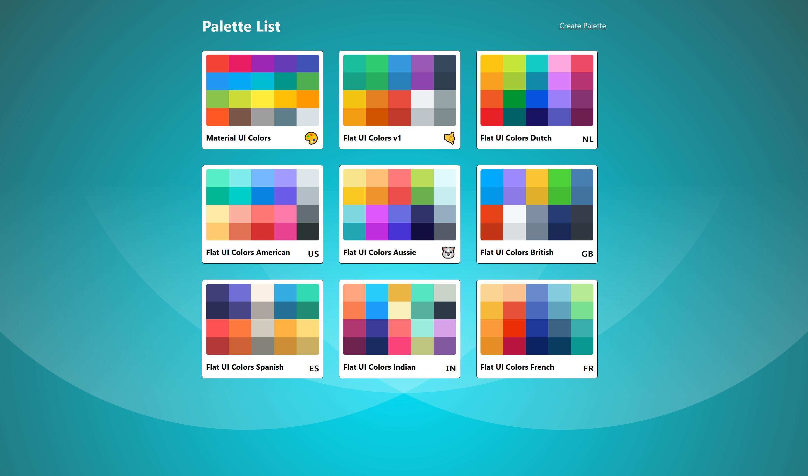

# Palette Town

> ##### Live Preview: https://angelo93.github.io/palette-town/

---

## Description:

Responsive React App for creating and managing custom color palettes.

Front page showing locally available palettes.

- User is able to delete and view locally saved palettes.

Palette creation page.

- Create and organize a new color palette.
- User is able the color picker or input color values in:
  - HEX, HSLA, & RGBA
  

Full palette view showing chosen swatches.

- Shows a pre-created color palette.
- Slider on the top changes shades of all swatches from lighter to darker.
- User is able to copy the color value to clipboard in the following formats:
  - HEX, RGB, RGBA
- Upon clicking more on a single swatch, user is able to see all shades of a single swatch.
  

Different shades of a single color swatch is shown.

- User is able to copy the color value to clipboard in the following formats:
  - HEX, RGB, RGBA
  

---

## Tech Stack:

- React Framework for component creation.
- React Router for dynamic route handling.
- Material UI for main navigation components.
- JSS API for styling components and routes.
- ChromaJS for main color features.
